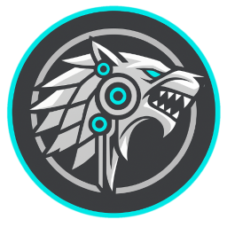

# STARK

## Latest Schema Version
[2.0.4](https://github.com/stellatechnologies/CyberDataSchema)

## Description

**STARK** (Space Technology for Acquisition, Reconnaissance, and K!lling) is a ficticious, advanced, space quadcopter designed for deployment on extraterrestrial planets. STARK's primary missions include:

- **Acquisition:** Locating, extracting, and storing precious gemstones from the planet's surface.
- **Reconnaissance:** Gathering detailed data on terrain, environmental conditions, and potential alien activities.
- **Threat Elimination:** Identifying and neutralizing aggressive and oppressive alien threats to ensure mission and operational safety.

STARK integrates sophisticated sensor systems, artificial intelligence, and autonomous control mechanisms to perform its tasks efficiently and effectively. This README provides an overview of STARK's mission profiles, system architecture, and captured data attributes.

STARK is a Systems Engineering and Cybersecurity model that is used for research and development in the development of Digital Cyber Engineering. STARK will continue to be updated and matured over time to both model and support emerging technologies, analytical needs, and digital tool development.

## Captured Objects/Attributes

## Quick Stats

| Class Type | Count | Class Type | Count |
| --- | --- | --- | --- |
| System | 448 | SecurityClassificationGuide | 1 |
| Mission | 234 | ClassificationStatement | 4 |
| OperationalData | 662 | ProgrammaticData | 20 |
| SystemConnection | 460 | Dissemination | 3 |
| SystemConnectionData | 521 | ClassificationControlCaveats | 1 |
| MissionData | 1084 | SystemProtectionLevel | 5 |
| Confidentiality | 5 | RDTEType | 4 |
| Integrity | 5 | InformationTechnologyType | 10 |
| Availability | 5 | AuthorizingOfficialType | 22 |
| AuthorizationBoundary | 3 | OperationalStatusType | 3 |
| ConnectionType | 5 | NSSQuestionaire | 1 |
| InterfaceType | 5 | CNSSQuestionaire | 1 |
| Interface | 23 | Program | 1 |
| ProgramDtl | 1 | UserDtl | 8 |
| User | 8 | UserType | 8 |
| ProgramUser | 8 | ClassificationType | 4 |

### Mission

| UUID | Name | Description | Children |
| --- | --- | --- | --- |
| ✅ | ✅ | ✅ | ✅ |

### OperationalData

| UUID | Name | Description |
| --- | --- | --- |
| ✅ | ✅ | ✅ |

### MissionData

| UUID | Mission_ID | OperationalData_ID | InputData | CIAJustification | Confidentiality_ID | Integrity_ID | Availability_ID |
| --- | --- | --- | --- | --- | --- | --- | --- |
| ✅ | ✅ | ✅ | ✅ | ✅ | ✅ | ✅ | ✅ |

### SystemConnection

| UUID | System1_ID | System2_ID | Interface1_ID | Interface2_ID | ConnectionType_ID |
| --- | --- | --- | --- | --- | --- |
| ✅ | ✅ | ✅ | ✅ | ✅ | ✅ |

### SystemConnectionData

| UUID | SystemConnection_ID | OperationalData_ID | SourceSystem_ID | TargetSystem_ID |
| --- | --- | --- | --- | --- |
| ✅ | ✅ | ✅ | ✅ | ✅ |

### System

| UUID | Name | Description | Parent_ID | AuthorizationBoundary_ID | Acronym | Software |
| --- | --- | --- | --- | --- | --- | --- |
| ✅ | ✅ | ✅ | ✅ | ✅ | ✅ | ✅ |

### Confidentiality

| UUID | Name | Acronym | Description | NumericValue |
| --- | --- | --- | --- | --- |
| ✅ | ✅ | ✅ | ✅ | ✅ |

### Integrity

| UUID | Name | Acronym | Description | NumericValue |
| --- | --- | --- | --- | --- |
| ✅ | ✅ | ✅ | ✅ | ✅ |

### Availability

| UUID | Name | Acronym | Description | NumericValue |
| --- | --- | --- | --- | --- |
| ✅ | ✅ | ✅ | ✅ | ✅ |

### AuthorizationBoundary
| UUID | Name | Description | Program_ID | Acronym | AuthorizingOfficialType_ID |
| --- | --- | --- | --- | --- | --- |
| ✅ | ✅ | ✅ | ✅ | ✅ | ✅ |

### ConnectionType
| UUID | Name | Wireless |
| --- | --- | --- |
| ✅ | ✅ | ✅ |

### InterfaceType
| UUID | Name | Wireless |
| --- | --- | --- |
| ✅ | ✅ | ✅ |

### Interface
| UUID | Name | System_ID | InterfaceType_ID |
| --- | --- | --- | --- |
| ✅ | ✅ | ✅ | ✅ |

### Program
| UUID | ProgramDtl_ID |
| --- | --- |
| ✅ | ✅ |

### ProgramDtl
| UUID | Name | Acronym | SystemPurpose | CONOPS | MDS | ForeignUsers | UserFullDataAccess | RDTEType_ID | ITType_ID | SystemProtectionLevel_ID | OperationalStatus_ID |
| --- | --- | --- | --- | --- | --- | --- | --- | --- | --- | --- | --- |
| ✅ | ✅ | ✅ | ✅ | ✅ | ✅ | ✅ | ✅ | ✅ | ✅ | ✅ | ✅ |

### User
| UUID | UserDtl_ID | Previous_ID |
| --- | --- | --- |
| ✅ | ✅ | ✅ |

### UserDtl
| UUID | FirstName | LastName | PhoneNumber |
| --- | --- | --- | --- |
| ✅ | ✅ | ✅ | ✅ |

### UserType
| UUID | Name |
| --- | --- |
| ✅ | ✅ |

### ProgramUser
| UUID | Program_ID | User_ID | UserTitle | UserType_ID |
| --- | --- | --- | --- | --- |
| ✅ | ✅ | ✅ | ✅ | ✅ |

### ClassificationType
| UUID | Name | Acronym |
| --- | --- | --- |
| ✅ | ✅ | ✅ |

### SecurityClassificationGuide
| UUID | Name | Version | CreatedDate | ModifiedDate | Program_ID | Parent_ID | Previous_ID | OperationalData | ProgrammaticData |
| --- | --- | --- | --- | --- | --- | --- | --- | --- | --- |
| ✅ | ✅ | ✅ | ✅ | ✅ | ✅ | ✅ | ✅ | ✅ | ✅ |

### ClassificationStatement
| UUID | Name | ClassificationTypes | ControlCaveats | Disseminations |
| --- | --- | --- | --- | --- |
| ✅ | ✅ | ✅ | ✅ | ✅ |

### ProgrammaticData
| UUID | Name | Details | Program_ID | Classification_ID |
| --- | --- | --- | --- | --- |
| ✅ | ✅ | ✅ | ✅ | ✅ |

### Dissemination
| UUID | Name | CodeName | PID |
| --- | --- | --- | --- |
| ✅ | ✅ | ✅ | ✅ |

### ClassificationControlCaveats
| UUID | Name | Acronym | Children |
| --- | --- | --- | --- |
| ✅ | ✅ | ✅ | ✅ |

### SystemProtectionLevel
| UUID | Name |
| --- | --- |
| ✅ | ✅ |

### RDTEType
| UUID | Name |
| --- | --- |
| ✅ | ✅ |

### InformationTechnologyType
| UUID | Categorization | Subset |
| --- | --- | --- |
| ✅ | ✅ | ✅ |

### AuthorizingOfficialType
| UUID | Name |
| --- | --- |
| ✅ | ✅ |

### OperationalStatusType
| UUID | Name |
| --- | --- |
| ✅ | ✅ |

### NSSQuestionaire
| UUID | Program_ID | Intel | Crypto | CommandControl | Weapon | Business |
| --- | --- | --- | --- | --- | --- | --- |
| ✅ | ✅ | ✅ | ✅ | ✅ | ✅ | ✅ |

### CNSSQuestionaire
| UUID | Program_ID | PIIPHI_ID | ClassifiedProcessed | Space | Mission | NC3 | ISR | CrossDomain |
| --- | --- | --- | --- | --- | --- | --- | --- | --- |
| ✅ | ✅ | ✅ | ✅ | ✅ | ✅ | ✅ | ✅ | ✅ |

*✅ Green Check Mark indicates the attribute is captured by the STARK Project.*

*❌ Red X indicates the attribute is not captured by the STARK Project, yet.*

## Contact

For inquiries, de-obfuscated data requests, or further refinement of objects and attributes, please reach out to our support team:

- **Email:** [info@stellatechnologies.space](mailto:info@stellatechnologies.space)
- **GitHub Issues:** [Open an Issue](https://github.com/stellatechnologies/STARK/issues)
- **Discord Channel:** [TBD]()

We welcome collaboration and feedback to enhance the STARK system's capabilities and ensure it meets all mission requirements effectively.

## About Stella Technologies

**Stella Technologies** is the original author and developer of the STARK system. We are dedicated to pushing the boundaries of space exploration technology and fostering innovation through advanced engineering and research.

## Open Source Support

Stella Technologies is committed to the long-term success and sustainability of the STARK project through open-source collaboration. We invite developers, researchers, and enthusiasts to contribute to STARK's ongoing development. Your contributions will help enhance STARK's capabilities, ensure its adaptability to future missions, and foster a vibrant community of innovators.

## License

This project is licensed under the MIT License.

